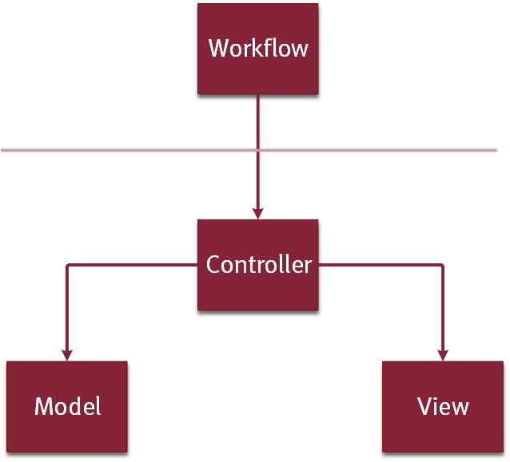

# Getting started with building single apps

## Creating a Project
*  Initialize a new project by navigating to `File` > `New` > `Project...`.
There, choose `Other` > `MD2 Project` and click "Next".
* Choose a project name that does not contain whitespaces or other non-alphanumerical characters.
If necessary, choose a location different from the proposed default.
* After clicking on "Finish", a default project structure is generated which you can extend as you need.

The new project contains the following folders:
* `src/` contains the MD² models of your application and is initialized with a simple default model.
* `resources/` contains resources that the generator will copy into the generated applications.
* `src-gen/` contains all artifacts that the generator derives from your model.
This folder will contain multiple subfolder for different mobile platforms as well as the backend.
Note, that everything in this directory will be overwritten when the generator is run.

## Developing a Single App
This section describes how an application can be developed based on the current state of the MD² DSL.
At its core, MD² is structured according to the MVC-pattern.
MVC stands for Model-View-Controller and ensures the principle of single responsibility for these classes.
In order to enable the modelling and generation of workflows within and across apps in MD², this architecture was extended to include an additional layer, the workflow layer.



All components in MD² are organized in a package structure that corresponds to the aforementioned structure.
Documents have to be placed in these packages (views, models, controllers or workflow).
For example, all view files are expected to be in the package `projectname.views`.
In every MD² file the package has to be defined as follows:
`package PACKAGE_NAME`.
The package name has to be a fully qualified name that reflects the actual folder structure.

### Workflow
The workflow layer provides abstraction on top of the controller layer.
While the controller contains most of the business logic, the workflow layer allows to specify the general course of action of one or more apps using a few simple and easily understandable model language constructs.
Furthermore, the abstract workflow representation is intended to serve as a basis for communication with customers, e.g. for requirements engineering and collaborative app development through rapid prototyping.

Workflows are specified as a (possibly cyclic) directed graph of workflow elements in the workflow file of an MD² model.
Workflow elements represent encapsulated functionality which needs to be further specified in the controller layer.
The workflow layer merely references the workflow elements from the controller layer to define their interaction.

Workflow elements are linked to each other via events.
For each workflow element one or more events can be specified that can be fired.
However, at runtime a workflow element can fire only one of these events, i.e. a parallel processing of the workflow is not intended.
Similar to the workflow elements, workflow events in the workflow layer are references to workflow events that are created in the respective controller.

In addition to the events that can be fired, the workflow element also specifies which workflow element is to be started in response to a fired event using the keyword `start`.
Moreover, when an event is fired, workflow elements can not only be started but the workflow can also be terminated using the keywords `end workflow`.
A workflow element in the workflow layer typically looks as follows:

```MD2
 WorkflowElement <NameOfWorkflowElement>
 	fires <NameOfEventOne> {
		start <NameOfSubsequentWfeOne>
	}
	fires <NameOfEventTwo> {
		end workflow
	}
```

After defining the sequence of workflow elements, the workflow also requires the specification of an application that executes the workflow elements.
As shown in the following listing, an app consists of its ID, a list of workflow elements that are used in the app and a name that is used as the app's title.
In the scenario where only a single app is modeled, all workflow elements can be included in the app.
However, it is also possible to have unused workflow elements.

```MD2
App <AppID> {
	WorkflowElements {
		<WorkflowElementOne>,
		<WorkflowElementTwo> (startable: STRING),
		<WorkflowElementThree>
	}
	appName STRING
}
```

A workflow has one or more entry points, i.e. startable workflow elements.
These are marked with `startable` in the app specification.
In the final application this will result in a button on the app's start screen that starts the corresponding workflow element.
In addition, an alias needs to be provided which is used as a label or description for the button.

A complete workflow specification for one app will be structured as shown in the next listing.
Note, that MD² does not explicitly define different workflows.
However, it is possible to implicitly create multiple workflows by using two or more startable workflow elements that start independent, disjunct sequences of workflow elements.

```
package <ProjectName>.workflows

WorkflowElement <WorkflowElementOne>
[...]
WorkflowElement <WorkflowElementTwo>
[...]
WorkflowElement <WorkflowElementThree>
[...]

App <AppID> {
	[...]
}
```

### Model
In the model layer the structure of data objects is being described.
As model elements Entities and Enums are supported.

#### Entity
An entity is indicated by the keyword `entity` followed by an arbitrary name that identifies it.
```
entity NAME {
	<attribute1 ...
attribute n>
}
```

Each entity may contain an arbitrary number of attributes of the form
```
ATTRIBUTE_NAME: <datatype>[] (<parameters>) {
	name STRING
	description STRING
}
```

The optional square brackets `[]` indicate a one-to-many relationship.
That means that the corresponding object may hold an arbitrary number of values of the given datatype.
Supported complex data types are:
* Entity
* Enum

Supported simple data types are:
* `integer` - integer
* `float` - float of the form `#.#`
* `boolean` - boolean (i.e. true or false)
* `string` - a string that is embraced by single quotes (') or double quotes (")
* `date` - a date is a string that conforms the following format: `YYYY-MM-DD`
* `time` - a time is a string that conforms the following format: `hh:mm:ss[(+|-)hh[:mm]]`
* `datetime` - a date time is a string that conforms the following format: `YYYY-MM-DDThh:mm:ss [(+|-)hh[:mm]]`
* `file` - a file to be uploaded and stored in an entity field

Parameters are optional and will be transformed into implicit validators during the generation process.
They have to be specified as a comma-separated list.
On default, each specified attribute is mandatory.
To allow empty values the parameter `optional` must be set.
Further supported parameters depend on the used data type and are available as follows:

* `integer` supports
  * `max INTEGER` – maximum allowed value of the attribute
  * `min INTEGER` – minimum allowed value of the attribute
* `float` supports
  * `max FLOAT` – maximum allowed value of the attribute
  * `min FLOAT` – minimum allowed value of the attribute
* `string` supports
  * `maxLength INTEGER` – maximal length of the string value
  * `minLength INTEGER` – minimal length of the string value

Optionally, attributes can be annotated with a name and a description which are used for the labels and the tooltips in the auto-generation of views.
If a tooltip is annotated an info icon, such as a question mark, will be shown next to the generated input field.
If no name is annotated, a standard text for the label will be derived from the attribute's name by transforming the camel case name to natural language, e.g. the implicit label text of the attribute `firstName` is "First name".
An exemplary entity is depicted in the following sample:

```MD2
entity Person {
	name: string
	birthdate: date {
		name: "Date of Birth"
		description: "The exact day of birth of this person."
	}
	salary: float (optional, min 8.50, max 1000)
	addresses: Address[]
}
```

#### Enum
An enumeration is indicated by the keyword `enum` followed by an arbitrary name that identifies it.
Each enum may contain an arbitrary number of comma-separated strings, as it is depicted in the following listing.
Other data types are not supported.

```MD2
enum Weekday {
	"Mon", "Tue", "Wed", "Thu", "Fri", "Sat", "Sun"
}
```

### View
View elements are either `ContentElements` or `ContainerElements` that can contain other content or container elements.
Furthermore, basic styles for some content elements can be defined.

#### Container Elements
*Grid layout panes* align all containing elements in a grid.
Elements can either be containers or content elements.
The grid is populated row-by-row beginning in the top-leftmost cell.

```
GridLayoutPane NAME (<parameters>) {
	<Container | Content | [Container] | [Content]>
	<Container | Content | [Container] | [Content]><...>
}
```

For each grid layout at least the number of rows or the number of columns has to be specified.
If only one of these parameters is given, the other one is automatically calculated by MD² during the generation process.
In case that both parameters are specified and there are too few cells, all elements that do not fit in the layout will be discarded.
The following comma-separated parameters are supported:

* `columns INTEGER` - the number of columns of the grid
* `rows INTEGER` - the number of rows of the grid
* `tabIcon PATH` - if the layout is a direct child of a `TabbedPane`, an icon can be specified that is displayed on the corresponding tab.
See section on TabbedPanes for more details.
* `tabTitle STRING` - if the layout is a direct child of a `TabbedPane`, a text can be specified that is displayed on the corresponding tab.
See section on TabbedPanes for more details.

A *flow layout pane* arranges elements (containers or content elements) either horizontally or vertically.
By default. all elements are arranged vertically in a left-to-right flow.

```
FlowLayoutPane NAME (<parameters>) {
	<Container | Content | [Container] | [Content]>
	<Container | Content | [Container] | [Content]>
	<...>
}
```

The following comma-separated parameters are supported:

* `vertical` or `horizontal` (default) - flow direction
* `tabIcon PATH` - if the layout is a direct child of a `TabbedPane` (which are described subsequently), an icon can be specified that is displayed on the corresponding tab.
* `tabTitle STRING` - if the layout is a direct child of a `TabbedPane`, a text can be specified that is displayed on the corresponding tab.

A *tabbed pane* is a special container element that can only contain container elements.
Each contained container will be generated as a separate tab.
Due to restrictions on the target platforms, tabbed panes can only be root panes, but not a child of another container element.
By default the title of each tab equals the name of the contained containers.
By using the `tabTitle` and `tabIcon` parameters, the appearance of the tabs can be customized.

```
TabbedPane NAME {
	<Container | [Container]>
	<Container | [Container]>
	<...>
}
```

#### Content Elements
*Input elements* can be used to manipulate model data via mappings (see subsection "Conroller").
At the moment `BooleanInputs`, `TextInputs`, `IntegerInputs`, `NumberInputs`, `TimeInputs`, `DateInputs`,´`DateTimeInputs`, `OptionInputs` and `FileUploads` are supported.
All input elements support the optional attributes `label`, `tooltip`, `type`, `disabled`, `default`, and `width`.

* `type` allows to specify the type of the field.
* `disabled` provides a boolean value for whether an input field is enabled or disabled.
* Default values can be set using `default`.
* The element's width can be set using `width`.

`TextInput` fields can be used for freetext as well as date and time inputs.

```
TextInput NAME {
	label STRING
	tooltip STRING
	type <TextInputType>
	disabled <true|false>
	default STRING)
	width <width>
}
```

`OptionInputs` are used to represent enumeration fields in the model.
In addition to the aforementioned attributes, OptionInputs support the optional `options` attribute.
This can be used to populate the input with the string values of the specified enum.
If options are not given, the displayed options depend on the enum type of the attribute that has been mapped on the input field (see subsection "Controller").

```
OptionInput NAME {
	label STRING
	tooltip STRING
	type <OptionInputType>
	disabled <true|false>
	default STRING
	width <width>
	options <enum>
}
```

`Labels` allow the modeler to present text to the user.
Often they are used to denote input elements.
For the label definition there exist the following default definition

```
Label NAME {
	text STRING
	style <[style] | style>
}
```

as well as this shorthand definition
```
Label NAME (STRING){
	style <[style] | style>
}
```

The text can either be annotated as an explicit text attribute or noted in parentheses directly after the label definition.
The optional style can either be noted directly, or by referencing an existing style definition (styles are described later in this section).

`Tooltips` allow the modeler to provide the user with additional information.
For the tooltip definition there exists the following default definition

```
Tooltip NAME {
	text STRING
}
```

as well as this shorthand definition that allows to note the help text in parentheses directly after the label definition
```
Tooltip NAME (STRING)
```

`Buttons` provide the user the possibility to call actions that have been bound on events of the Button.
For the button definition there exists the following default definition

```
Button NAME {
	text STRING
}
```

as well as this shorthand definition that allows to specify the text in parentheses directly after the button definition
```
Button NAME (STRING)
```

For the `image` exists the following default definition

```
Image NAME {
	src PATH
	height INT
	width INT
}
```

as well as this shorthand definition that allows to specify the image path in parentheses directly after the image name
```
Image NAME (PATH) {
	height INT
	width INT
}
```

Images support the following attributes:

* `src` - Specifies the source path where the image is located.
The path has to be relative to the directory `/resources/images` in the folder of the MD² project
* `height` (optional) - Height of the image in pixels
* `width` (optional) - Width of the image in pixels

While the `Image` construct can only be used to display images that have a fixed URI, the `UploadedImageOutput` can be used to display images that are stored in a field of an entity and were uploaded before.
`UploadedImageOutput` features the same attributes as `Image` and is specified as follows.

```
UploadedImageOutput NAME {
	height INT
	width INT
}
```

`FileUpload` is an input element for files.
Using this construct, a button having the specified attributes and allowing for uploading a file is displayed on the respective UI form.
`FileUpload` can be specified using the following attributes.

```
FileUpload NAME {
	label STRING
	text STRING
	tooltip STRING		
	style <[style] | style>
	width INT%
}
```

To be able to display an uploaded image using the `UploadedImageOutput` construct, it is necessary to map the respective view elements to the corresponding entity fields in the controller as it is applicable for all other view content elements.

A `Spacer` is used in a `GridLayoutPane` to mark an empty cell or in a `FlowLayoutPane` to occupy some space.
Using an optional additional parameter the actual number of generated spacers, i.e. the number of occupied cells in a `GridLayoutPane`, can be specified: `Spacer (INT)`.

The `AutoGenerator` is used to automatically generate view elements to display all attributes of a related entity and the corresponding mappings of the view elements to a content provider.
It is possible to either exclude attributes using the `exclude` keyword or to provide a positive list of attributes using the keyword `only`:

```MD2
AutoGenerator NAME {
	contentProvider [ContentProvider] (exclude|only [Attribute])
}
```

In case of one-to-many relationships for attributes (annotated with `[]`) or a content provider, it has to be defined which of the elements should be displayed in the auto-generated fields.

The `EntitySelector` allows the user to select an element from a list of elements.
The attribute `textProposition` defines which content provider stores the list and which attribute of the elements shall be displayed to the user to allow him to find the desired element.

```
EntitySelector NAME {
	textProposition [ContentProvider.Attribute]
}
```

`Styles` can be annotated to several view elements such as labels and buttons to influence their design.
They can either be defined globally as a root element in the view and then be referenced, or annotated directly to the appropriate elements.

```
style NAME {
	color <color>
	fontSize INT
	textStyle <textstyle>
}
```

The following optional style attributes are supported.
If an attribute is not set, the standard setting is used for each platform.

* `color <color>` (optional) - specifies the color of the element as a named color or a six or eight digit hex color (with alpha channel)
* `fontSize INT` (optional) - specifies the font size
* `textStyle <textstyle>` (optional) - the text style can be `normal` or `italic`, `bold` or a combination of both.

Sixteen default web colors are available as named colors: `aqua, black, blue, fuchsia, gray, green, lime, maroon, navy, olive, purple, red, silver, teal, white, yellow`.

Elements can not only be defined at the place they should be used, but there is also a mechanism to define an element once and `reuse` it several times.
Instead of defining a new element, another element can be referenced - internally this leads to a copy of the actual element during the preprocessing.
However, names have to be unique so that each element could only be referenced once.
To avoid those name clashes a renaming mechanism had been implemented that allows to set new names for the actual copied element.

```
Element -> NAME
```

### Controller

#### Main
The `main` object contains all basic information about a project.
Each project must contain exactly one `main` object that can be in an arbitrary controller.

```
main {
	appVersion STRING
	modelVersion STRING
	workflowManager [RemoteConnection]
	defaultConnection [RemoteConnection]
	fileUploadConnection [RemoteConnection]
}
```

The attributes are explained as follows:

* `appVersion` - a string representation of the current app version, e.g. "RC1"
* `modelVersion` - a string representation of the current model version that has to be in accordance with the model version of the backend
* `defaultConnection` (optional) - a default remote connection can be specified, so that it is not necessary to specify the same connection in each content provider
* `workflowManager` - the remote connection to the workflow manager, which may be different from the default backend connection
* `fileUploadConnection` (optional) - a remote connection to the file upload server must be specified if a file is expected to be uploaded or an uploaded file to be displayed.
This connection can be similar to the default connection, but storing large amounts of files on a separate server is encouraged.
Specifying the connection is obligatory if at least one `UploadedImageOutput` or `FileUpload` is present in the views.

Furthermore, the controller layer is subdivided into one or more workflow elements.
While a workflow describes the interaction of workflow elements, their internal functionality needs to be specified in the controller layer.
Each workflow element can be seen as an independent controller which is responsible for the successful execution of its functionality.
In general, workflow elements are structured as follows

```MD2
WorkflowElement <workflowElementName>{
	defaultProcessChain <ProcessChain>
	onInit {
		<...>
	}
	<...>
}
```

Workflow elements work with `ProcessChains` that allow to define a sequence of steps inside the workflow element.
Since several process chains can be defined in a single workflow element, the `defaultProcessChain` keyword is used to set a default process chain.
This process chain will then be used as starting point for the workflow element and the first view to be shown will be derived from it.

The `onInit` block is used to define everything that is supposed to happen upon the initialization of the workflow element, e.g. binding actions to buttons or mapping content to view fields.
In the `onInit` block, no workflow events may be fired, as this means handing off control from the workflow element directly during the initialization.
This is enforced by through a validator that raises an error in case the modeler tries to throw an event here.

Typically, workflow elements should be modeled in a way that they fire a workflow event after termination of their functionality to start a new workflow element or end the whole workflow.
This can be done using the SimpleAction `FireEventAction`.

#### Actions
An action provides the user the possibility to declare a set of tasks.
An action can be either a `CustomAction` or a `CombinedAction`.

A `CustomAction` contains a list of `CustomCodeFragments` where each CustomCodeFragment contains one task.

```
CustomAction <Action> {
	<CustomCodeFragment>
	<...>
}
```

For each type of task there exists a specific `CustomCodeFragment` that is distinguished by the keyword that introduces it.

* ```bind <Action1> ...
<ActionN> on <Event1> ...
<EventN>```
* ```bind <Validator1> ...
<ValidatorN> on <ViewElement1> ...
<ViewelementN>```
* ```unbind <Action1> ...
<ActionN> from <Event1> ...
<EventN>```
* ```unbind <Validator1> ...
<ValidatorN> from <ViewElement1> ...
<ViewelementN>```
* ```call <Action>```
* ```map <ViewElement> to <ContentProviderField>```
* ```unmap <ViewElement> from <ContentProviderField>```
* ```set <ContentProvider> = <Expression>```
* ```set <ViewElement> = <Expression>```
* ```if (<Condition>) { <CustomCodeFragment> }
elseif (<Condition>) { <CustomCodeFragment> }
else {<CustomCodeFragment>}```

The main tasks are binding actions to events, binding validators to view elements and mapping view elements to model elements.
For every task there is a counterpart for unbinding and unmapping.
`call` tasks can call other actions, `set` operations set the value of a content provider field or a view element.
The `if`, `elseif` and `else` blocks allow to model case distictions, e.g. based on user input.

*Actions* are bound to events.
There are several types of actions and events available.
`CustomActions` and `CombinedActions` are referenced externally whereas `SimpleActions` are declared directly.
For events, there are local event types that listen to the state of a certain view element as well as global event types.
The most powerful event type is the OnConditionEvent.

`SimpleActions` provide a quick way to perform functionality:

* `ProcessChainProceed`: ProcessChainProceedAction to proceed to the next ProcessChain step
* `ProcessChainReverse`: ProcessChainReverseAction to go back to the last ProcessChain step
* `ProcessChainGoto <processChainStep>`: ProcessChainGotoAction to  change to the given ProcessChain step
* `SetProcessChain [ProcessChain]`SetProcessChainAction to change the current ProcessChain
* `GotoView (<ViewElement>)`: GotoViewAction to change to the given view element
* `Disable (<ViewElement>)`: DisableAction to disable a view element
* `Enable (<ViewElement>)`: EnableAction to enable a view element
* `DisplayMessage (<SimpleExpression>)`: DisplayMessageAction to display a message
* `ContentProviderOperation (<AllowedOperation> <ContentProvider>)`: ContentProviderOperationAction to perform a CRUD action (save, load, remove) on the given ContentProvider
* `ContentProviderReset (<ContentProvider>)`: ContentProviderResetAction to reset the given ContentProvider
* `FireEvent (<WorkflowEvent>)`: FireEventAction to fire a workflow event to the backend.
In response a new workflow element will be started or the workflow terminated.
* `WebServiceCall (<WebServiceCall>)`: WebServiceCallAction to send a request to call an external web service to the backend (for details cf. "CallingWebServices").
* The `LocationAction` allows to extract an address from content provider fields and generate a geographic location (i.e. longitude and latitude) for this address.
For this purpose, all input and output fields have to be defined.
The calculation result for longitude and latitude will be written in their respective output fields.
The LocationAction is structured as follows:

```MD2
Location (
	inputs (
		cityInput <ContentProviderPath>
		streetInput <ContentProviderPath>
		streetNumberInput <ContentProviderPath>
		postalInput <ContentProviderPath>
		countryInput <ContentProviderPath> )
	outputs (
		latitudeOutput <ContentProviderPath>
		longitudeOutput <ContentProviderPath>)
)
```

There are different event types available:

* `ElementEventTyp` - `onTouch, onLeftSwipe, onRightSwipe, onWrongValidation`; preceded by a dot and a reference to a `ContainerElement` or `ContentElement`
* `GlobalEventType` - onConnectionLost
* `OnConditionEvent`

The `OnConditionEvent` provides the user the possibility to define own events via conditions.
The event is fired when the conditional expression evaluates to true.

```MD2
event NAME {
	<Condition>
}
```

A `Condition` allows to combine conditional expressions using the operators `and`, `or` and `no`!.
Conditional expressions evaluate to true or false.
They can be `BooleanExpressions`, `EqualsExpressions` or `GUIElementStateExpressions` that check the state of a `ViewGUIElement`.
In addition, MD² supports mathematical expressions such as `equals`, `>`, `<`, `>=`, and `<=`.

`Validators` are bound to view elements.
The validator can be a referenced element or a shorthand definition can be used in place.

```MD2
bind|unbind validator
	<[Validator]> <...>
	on|from
	<[ContainerElement] | [ContentElement]> <...>
```

The shorthand definition has the same options but does not allow reuse.

```MD2
bind|unbind validator
	<IsIntValidator | NotNullValidator | IsNumberValidator | IsDateValidator | RegExValidator |NumberRangeValidator | StringRangeValidator (<parameters>)
	on|from
	<[ContainerElement] | [ContentElement]> <...>
```

A detailed description for validator types can be found in the validator description in the following.
The available parameters are identical to those of the validator element.

View elements are *mapped* to model elements that are in turn accessed through a content provider.

```MD2
map|unmap
	<[ContainerElement] | [ContentElement]>
	to|from
	<[ContentProvider.Attribute]>
```

`CallTasks` call a different action.

```MD2
call
	<[CustomAction] | [CombinedAction] | [SimpleAction]>
```

`CombinedActions` allow the composition of actions.

```MD2
CombinedAction NAME {
	actions <Action> <...>
}
```

`Validators` are used to validate user input.
For each validator type corresponding parameters can be assigned.
The `message` parameter is valid for every type and will be shown to the user if the validation fails.

* The `RegExValidator` allows the definition of a regular expression that is used to validate the user input.
```MD2
validator RegExValidator NAME (message STRING regEx STRING)
```
* The `IsIntValidator` checks whether the user input is a valid integer.
```MD2
validator IsIntValidator NAME (message STRING)
```
* The `IsNumberValidator` checks whether the user input is a valid integer or float value.
```MD2
validator IsNumberValidator NAME (message STRING)
```
* The `IsDateValidator` allows to define a format that the date at hand shall conform to.
```MD2
validator IsDateValidator NAME (message STRING format STRING)
```
* The `NumberRangeValidator` allows the definition of a numeric range that shall contain the user input.
```MD2
validator NumberRangeValidator NAME (message STRING min FLOAT max FLOAT)
```
* The `StringRangeValidator` allows the definition of a string length range.
The length of the `STRING` input by the user will be checked against this range.
```MD2
validator StringRangeValidator NAME (message STRING minLength INT maxLength INT)
```
* The `NotNullValidator` makes the input field required.
```MD2
validator NotNullValidator NAME (message STRING)
```

The `RemoteValidator` allows to use a validator offered by the backend server.
By default only the content and id of the field on which the RemoteValidator has been assigned are transmitted to the backend server.
However, additional information can be provided using the `provideModel` or `provideAttributes` keyword.

```MD2
validator RemoteValidator NAME (message STRING connection <RemoteConnection> model <ContentProvider>) |
validator RemoteValidator NAME (message STRING connection <RemoteConnection> attributes <ContentProvider.Attribute> <...>)
```

#### Process Chains
A `ProcessChain` is used to define several steps in which the workflow element can currently be.
It is possible to define several process chains.
Process chains can be nested and there can be only one active process chain.

```MD2
ProcessChain NAME {
	<ProcessChainStep> <...>
}
```

Each `ProcessChainStep` specifies a view that will be displayed once the process chain step becomes the current process chain step of the active process chain.
Additionally, conditions can be defined that restrict switching to the next or previous process chain step.
Events can trigger changing to the next or previous process chain step.

Instead of the default of proceeding and reversing along the process chain, another step in the process chain will become active as successor or predecessor, if referenced using `goto` or `returnTo`.

```MD2
step NAME:
	view <[ContainerElement] | [ContentElement]>
	proceed {
		on <Event>
		given <Condition>
		do <Action>
	}
	reverse on <Event>
	(goto <ProcessChainStep> | returnTo <ProcessChainStep>) on <Event>
	return on <Event>
	return and proceed on <Event>
	message STRING
```

Process chains can be refined using sub process chains.
```MD2
step NAME:
	subProcessChain <ProcessChain>
```

The event definition for `EventDef` is the same as for event bindings:

```MD2
<Container | Content> .
<elementEventType> |
<GlobalEventType> |
<OnConditionEvent> <...>
```

#### Content Providers
Each content provider manages one instance of an entity.
View fields are not mapped directly to a model element, but only content providers can be mapped to view elements.
Data instances of the content providers can be updated or persisted using DataActions.

It allows to create or update (save), read (load) or delete (remove) the stored instance.
Which of those operations is possible is specified in `allowedOperations`.
By default all operations are allowed.
A filter enables to query a subset of all saved instances.
The `providerType` defines whether the instances shall be stored locally or remotely.

#### Remote Connections
A remote connection allows specifying a URI for the backend communication as well as a path to specify the storage location of files to be uploaded.
The backend must comply with the MD² web service interface as specified in the section on the [backend web service specification](060_backend-generator.html).

```MD2
remoteConnection NAME {
	uri URI
	storagePath PATH
}
```

Furthermore, the MD² framework also provides a *location provider*, i.e. a virtual content provider for locations.
The entity which is automatically handled by this content provider contains attributes such as latitude, longitude, street, etc.


## Deploying a Single App

### Backend
The following steps will start the GlassFish server that is used to deploy the backend.
Note, that in order to access the server you might need to grant additional privileges in the configuration of your firewall.d (Linux) or the requested Firewall ports (Windows), respectively.

* Within the GlassFish installation directory, navigate to `glassfish/bin/`.
* Run the `asadmin` utility (Windows: Double-click on `asadmin.bat`; Linux/OS X: Open a terminal in that directory and run `./asadmin`).
* In the GlassFish administration utility, type `start-database` to start the Derby database for the backend.
In a Unix environment, you can combine both steps by running `./asadmin start-database`.
* Start Eclipse and import the generated project `<PROJECT_NAME>.backend` by choosing "General" > "Existing Projects into Workspace" in the import wizard.
* In the Project Explorer tab, right-click the project in Eclipse, choose "Properties", and navigate to "Targeted Runtime".
* Deselect all runtimes and click "Apply".
* Select the item "GlassFish 4.0" and click "Apply".
* Correct JRE-related build path problems, if any, by resorting to the default JRE.
* Confirm by clicking "OK".
* In the Servers tab, right-click the "GlassFish 4.0" entry, and choose "Add/Remove".
* Add the backend project to the server.
* Start the server.

## What's next
* [Information needed for the development of multiple apps](240_multiple-apps.html)
* [information about more advanced additional features of the language](250_additional_features.html)
