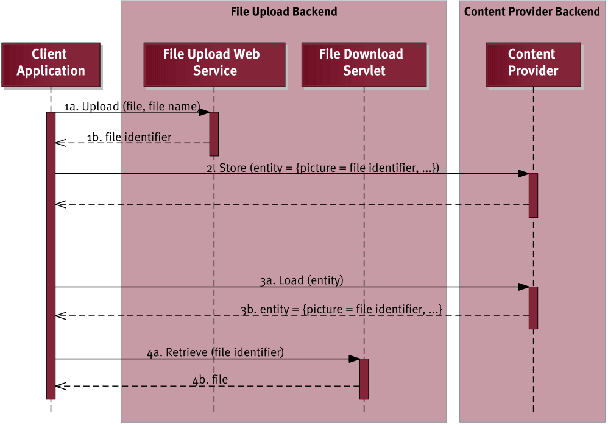

# The backend generator

The MD² backend is implemented in Java.
It is automatically generated by from the MD² model.
Note, that some parts of the backend are static while others are contingent upon the model.

## Beans
For entities that are used in at least one remote content provider, a stateless session bean is generated.
Such a bean provides basic methods to create or manipulate entities of its type.
The Java Persistence API (JPA) is used for the persistent storage of the data.
The persistence configuration file is located at `META-INF/persistence.xml`.
Currently, EclipseLink is used as persistence service.

Additionally, a static session bean is generated for the workflow state of the instances of a workflow.
Internally, a workflow instance is identified by a unique ID that is represented as an integer.
However, since a workflow instance is generated on the client side, a single client cannot assure that a specific number is not used by another workflow instance of another client.
Therefore, every client generates its own `instanceId` that is a hash value of the current time and other variables, and thus supposed to be unique.
This generated hash value is represented as a string value.

## Datatypes
The datatypes used in the backend are static and implemented as simple wrappers.
For instance, every entity has a unique internal identification number (`internalID`) that is an integer value.
The respective wrapper implementation is depicted in the following listing.

```Java
@XmlRootElement(name = "internalId")
public class InternalIdWrapper {

	@XmlElement
	protected int __internalId;

	protected InternalIdWrapper() {
		// no-arg default constructor necessary
	}

	public InternalIdWrapper(int integer) {
		this.__internalId = integer;
	}
}
```

## Entities
The entities and enumerations defined in the MD² model are generated into the subpackage `entities.models`.
Moreover, two static Java classes are generated: `RequestDTO` and `WorkflowState`.
The former is used as an encapsulation for all client requests, e.g. to create a corresponding REST request.
The latter is used as a representation of the state a particular workflow instance has.
A workflow can consist of multiple workflow elements, that in turn can fire different events.
Thus, every started workflow (more precisely, every workflow instance) must keep track of its current workflow element and the last event fired in it.

## File Download Servlet
This servlet is used to deliver uploaded files to a requesting client.
It is accessible at `DownloadFile` below the web root of your deployed project.



In a *GET* request to this servlet you need to set the parameter `file` to the identifier of an uploaded file, which was returned by the file upload web service before (cf.
upload process depicted above).

All files are stored in the file system.
Therefore, the download servlet needs to look for files using the identifier in a central directory, which is also referenced by the upload web service.
This location  is defined in the generated `Config.UPLOAD_FILE_STORAGE_PATH`, which is derived from the `storagePath` element in the file upload remote connection in your MD² model.

Note, that currently only images can be delivered, as the download servlet assumes the content type to be `image/jpeg`.
This could be changed in the future by storing the correct content type during upload and retrieving it in this servlet.

## Web Services
Similar to the generation of the stateless session beans, a web service is only generated for those entities that are used in at least one remote content provider.
Those web services provide simple access to entity data.
Additionally, some static web services are generated that are used for specific features.
Those are explained in the following.

### Calls to External Webservices
As a simple way to interact with external services, a web service `CallExternalWebServiceWS` in the backend allows to call another web service, that might be on a different system or server.
The web service in the backend provides a method that takes a JSON-encoded object as an input.
This object must contain the URL, the REST method type and the set of parameters of that method.
For example, the following listing depicts how such a JSON object is constructed in map.apps.

```JavaScript
data: json.stringify({
  "url": this._url,
  "requestMethod": this._method,
  "queryParams": this._queryParams,
  "body": this._bodyParams
})
```

`queryParams`, as well as `bodyParams`, are basically key-value pairs.
However, the Java library used for the REST endpoint was not able to map these key-value pairs to a Java `HashMap`.
For that reason a workaround was introduced: Instead of a single JSON object containing all key-value pairs, an array of JSON objects needs to be transmitted, where each object contains exactly one key-value pair.
In the backend, these are mapped to an object of type `ArrayList<CustomHashMapEntry>`.
The class `CustomHashMapEntry` (and, therefore, each JSON object) consists of the attributes `key` and `value`.

### Offer Webservices to Start Workflow
Besides the possibility to start a workflow through an app, it is possible to invoke it using a webservice.
The description of the corresponding model language is described in the Modeler's handbook in the [additional features](550_additional_features.html) section.
For each invokable workflow element a webservice is created and for each invoke definition a webservice endpoint is specified, including the defined parameters and the creation of the required entities.
After the entities are saved using the internal beans, a `workflowState` is persisted using the workflow element the webservice belongs to.
Additionally, the `lastEventFired` is set to the defined text specified in the workflow model after the `invokable` keyword, or to a default if not specified.
The entity IDs returned by the internal beans are then injected as the content provider IDs.
Directly afterwards, the workflow instance is accessible within the list of open issues of all apps that are allowed to view the invoked workflow element.
Since a new workflow instance is created, the backend is creating a new random UUID for each webservice call.

For each endpoint, a method `@POST` or `@PUT` can be defined.
The used parameter types are specified as `@FormParam`.
The path which has to be used to call the webservice endpoint consists of the workflow element name and the specified path in the invoke definition.

### Event Handler
For the communication across apps, the backend offers an event handler web service.
This web service handles all workflow events that are fired in one app and need to start a workflow element in another app.
Required parameters for this web service are

* the instance ID of the workflow instance,
* the event which was fired,
* the content provider IDs, and
* the current workflow element which fired the event.

The event handler web service uses these parameters to perform adjustments in the workflow state of the current workflow instance.
This includes setting the last event fired and the current workflow element.
Furthermore, the content provider IDs are stored in the workflow state so that subsequent apps can load data from content providers using these IDs.

### Workflow State
The workflow state web service allows to retrieve open workflow instances or add new ones.
Whenever the list of open issues is opened in an app, this app sends its name to the workflow state web service.
The web service then returns all workflow states whose current workflow element is part of the app with the given app name.
For this purpose, the mapping of workflow elements to apps is originally derived from the DSL model and stored in a `HashMap` object in the backend.

Furthermore, for every new workflow instance, a new workflow state needs to be created.
To do so, the workflow state web service is called as soon as the app which started the workflow hands the control over to the backend.
This app generates a globally unique identifier (as described in the first subsection "Beans") and provides it in the web service call.

### File Upload
As another web service, a REST endpoint for uploading files is provided.
In contrast to the other web services, it expects an input format of `MULTIPART_FORM_DATA`, thus allowing image uploads from HTML forms.

Given an uploaded file, it creates a file with a unique file name using the `File.createTempFile()` interface.
The file is stored in the location specified in `Config.UPLOAD_FILE_STORAGE_PATH` (or `storagePath` in the MD² model, respectively) and the generated file name is returned to the invoking client.
No further information about the file is stored or checked, i.e. original file name and content type are lost.

### Version Negotiation
This web service can be used by generated apps to check whether they were generated from the same model version as the backend.
Consequently, this is only useful if the modeler updates the model version after making changes to the data model.

## Backend connection specification

### Resource Paths
**Format:**

VERB - Path - Request body
> `<Status>` - `<Response body>`

#### Entities
**Load**

`GET - /<entity.name>/?filter=<filter>`
> `200 OK - List<Entity>`

`GET - /<entity.name>/first?filter=<filter>`
> `200 OK - Entity or 404 NOT FOUND`

**Save**

`PUT - /<entity.name>/ - List<Entity>`
> `200 OK - List<{ “__internalId”: <id> }>`

**Delete**

`DEL - /<entity.name>/<id>`
> `200 OK or 404 NOT FOUND`

#### Remote Validations
`GET - /md2_validator/<remoteValidator.name>/ - Entity`
> `200 OK - ValidationResult object`

`GET - /md2_validator/<remoteValidator.name>/?attrName1=content&attrName2=content ... &attrNameN=content`
> `200 OK - ValidationResult object`

attrNameX is a fully qualified name, having `contentProviderName.path.to.attribute`

#### Filter Parameter
`not <Attribute> (equals|greater|smaller| <= | >=) (<Int>|<Float>|<String>|<InputField>)
((and|or)(not)? <Attribute> (equals|greater|smaller| <= | >=) (<Int>|<Float>|<String>|<InputField>))*
`

#### Resource for Model Version Checks
The model version should be checked by the apps for all remote connections. Requests are only valid if the server accepts the current model version.

`GET /md2_model_version/current`
> `200 OK - <version>`

`GET /md2_model_version/is_valid?version= <version>`
> `200 OK - { "isValid": (true|false) }`

### JSON Format Conventions
**List<Entity>:**
```Javascript
{
	"entityName": [
	{
		"attribute": <Value type see below>,
		[...]
	},
	{
		"attribut": <Value type see below>,
		[...]
	} [...]
	]
}
```
having `<Entity>` = Entity without root node

**Entity:**
```Javascript
{
	"entityName": [
		"attribute": <Value type see below>,
		[...]
	}
}
```

**Validation Result:**
```Javascript
{
	"ok": (true|false),
	"error": [
	{
		"message": "Allgemeine Fehlermeldung",
		"attributes": ["attribut1", "attribut2"]
	},
	{
		"message": "can’t be blank",
		"attributes": ["forename", "surname"]
	}
	]
	[...]
}
```

**Data type mapping**:

 Format: MD² language data type -> JSON type for attribute values

* `Enum` -> `Int` (index of the currently selected value)
* `Int` -> `Number`
* `Float` -> `Number`
* `Date` -> `String` (with format "yyyy-mm-ddThh:mm:ss+hh:m")
* Everything else -> `String`

### Examples

*GET* `/customer/first` returning one customer
```Javascript
{
	"customer": {
		"__internalId": "0",
		"firstName": "Ulrich",
		"lastName": "M\u00c3\u00bcller",
		"membership": "1",
		"professionalCategory": "0"
	}
}
```

*GET* `/customer` returning multiple customers
```Javascript
{
	"customer": [
	{
		"__internalId": "0",
		"firstName": "Ulrich",
		"lastName": "M\u00c3\u00bcller",
		"membership": "1",
		"professionalCategory": "0"
	},
	{
		"__internalId": "0",
		"firstName": "Hans",
		"lastName": "Dampf",
		"membership": "1",
		"professionalCategory": "0"
	}
	]
}
```

## What's next
* [The structure of the Android generator](070_android-generator.html)
* [The structure of the iOS generator](080_ios-generator.html)
